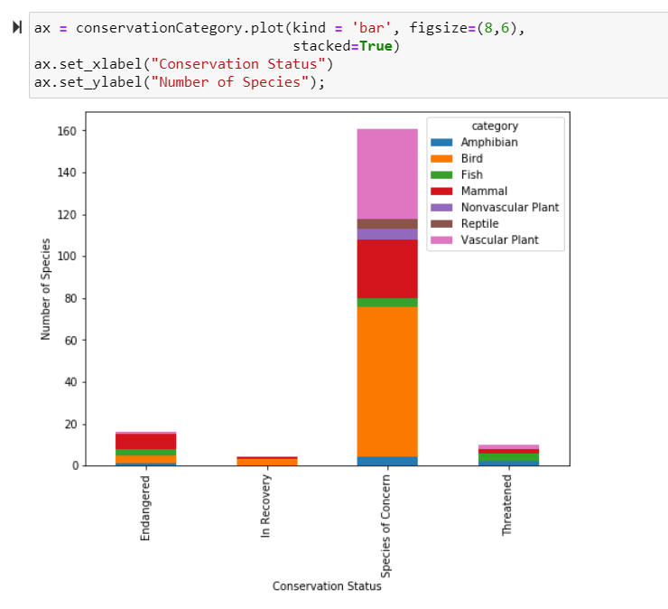

# Biodiversity in National Parks
## Overview

For this project, you will interpret data from the National Parks Service about endangered species in different parks.

You will perform some data analysis on the conservation statuses of these species and investigate if there are any patterns or themes to the types of species that become endangered. During this project, you will analyze, clean up, and plot data as well as pose questions and seek to answer them in a meaningful way.

After you perform your analysis, you will share your findings about the National Park Service.

[Example Project](https://content.codecademy.com/PRO/paths/data-science/biodiversity-solution.zip)

**Project Objectives:**

- Complete a project to add to your portfolio
- Use Jupyter Notebook to communicate findings
- Run an analysis on a set of data
- Become familiar with data analysis workflow

**Prerequisites:**

- Data Visualization
- Communicating Data Science Findings

## Setup

### Necessary Files:
Click this link to download a zip file with the necessary starter code and design assets. Note that biodiversity.ipynb is a blank file and should be used to create your project.

### Going off platform:
For this particular project, you will be using Jupyter Notebook and Git version control. If you need help with your setup, read our articles about getting started off platform:

- [Command Line Interface Setup](https://www.codecademy.com/articles/command-line-setup)
- [Introducing Jupyter Notebook](https://www.codecademy.com/articles/introducing-jupyter-notebook) 
- [Setting up Jupyter Notebook](https://www.codecademy.com/articles/setting-up-jupyter-notebook)
- [Getting Started with Jupyter](https://www.codecademy.com/articles/getting-started-with-jupyter)
- [Getting More out of Jupyter Notebook](https://www.codecademy.com/articles/getting-more-out-of-jupyter-notebook)

If you need a refresher on how to work with Git for version control, review the [GitHub Desktop](https://codecademy.com/articles/what-is-git-and-github-desktop) article and additional help on this [Git cheat sheet](https://education.github.com/git-cheat-sheet-education.pdf),

## Resource

### Example Code
What to see an example of how someone else has completed this project? Download a zip file containing one example solution to this project.. Remember: your project doesn’t have to look anything like this! It should be unique to your vision.

**Debugging Tips + Helpful Resource.**

Feeling stuck? Try the following:

- **Google your question**: oftentimes, someone has had the same question as you! Check out websites like StackOverflow and Dev.to to see how other folks have found solutions.
- **Read the documentation**: make sure to carefully read through the documentation for any languages and libraries that you are using. Oftentimes they’ll have examples of what you’re looking for!
- **Rubber ducking**: try to explain a problem to a friend or co-worker. Oftentimes you’ll figure out the solution as you’re trying to explain it. And if not, getting another pair of eyes on your code can be helpful.

Check out these helpful resources:

- [Matplotlib tutorial](https://matplotlib.org/tutorials/introductory/pyplot.html)
- [seaborn examples](https://seaborn.pydata.org/examples/index.html)
- [NumPy tutorial](https://numpy.org/doc/stable/user/quickstart.html)
- [pandas user guide](https://pandas.pydata.org/docs/user_guide/10min.html)

## Project Tasks

Keep track of your progress by dragging each task from "To Do" to "In Progress" to "Done" as you work on them. You can also click on a task to see more information about it.

### To Do

**Setting up the Project**

First we will have to download our data from biodiversity.zip and make sure our directory is set up for Jupyter notebook.

1. Download the [biodiversity.zip](https://content.codecademy.com/PRO/paths/data-science/biodiversity-starter.zip)
2. Double-click on it to "unzip" the folder. It should contain several items:
`Observations.csv`
`Species_info.csv`
`Biodiversity.ipynb`
3. In the command line, navigate into the unzipped file directory.
4. Type the following into the command line: jupyter notebook This should open a browser tab.
5. Click on `Biodiversity.ipynb` in the browser tab. This will open up your Jupyter Notebook.

More Resources:

[How to Use Jupyter Notebook](https://www.codecademy.com/articles/how-to-use-jupyter-notebooks-py3)

---

**Setting up your Git Repository**
Create a new Git repository for this project.

If you need more guidance, review the GitHub Desktop article and additional help on this Git cheat sheet.

Main components that you will want to include:

- Jupyter Notebook
- CSV data file(s)

---

**Project Scoping**

Properly scoping your project will greatly benefit you; scoping creates structure while requiring you to think through your entire project before you begin. You should start with stating the goals for your project, then gathering the data, and considering the analytical steps required. A proper project scope can be a great road map for your project, but keep in mind that some down-stream tasks may become dead ends which will require adjustment to the scope.

Here is University of Chicago’s [Data Science Project Scoping Guide](http://www.datasciencepublicpolicy.org/home/resources/data-science-project-scoping-guide/).

---

**Load the Data**

You have been given two CSV files:

- `species_info.csv` - contains data about different species and their conservation status
- `observations.csv` - holds recorded sightings of different species at several national parks for the past 7 days

Open `observations.csv` and `species_info.csv` with pandas. The datasets provided have the following columns of data:

`species_info.csv`:

- category - class of animal
- scientific_name - the scientific name of each species
- common_name - the common names of each species
- conservation_status - each species’ current conservation status

`observations.csv`:

- scientific_name - the scientific name of each species
- park_name - Park where species were found
- observations - the number of times each species was observed at park
Read over the [pandas `read_csv`](https://pandas.pydata.org/pandas-docs/stable/reference/api/pandas.read_csv.html) documentation for a refresher on how to load and look at the dataset

---

**Explore and Explain Data**

Once you have your data, it’s a good idea to get acquainted with it. You should show some summary statistics and visually examine your data. Don’t forget to write out some insights that you have gained along with your analysis.

You can start to build graphs from the data by first importing [Matplotlib](https://matplotlib.org/tutorials/introductory/pyplot.html) or [seaborn](https://seaborn.pydata.org/introduction.html) and then making some plots!

Some components that you may want to include:

- What is the distribution of conservation_status for animals?
- Are certain types of species more likely to be endangered?
- Are the differences between species and their conservation status significant?
- Which species were spotted the most at each park?

More Resources:

The National Institute of Standards and Technology’s (NIST) [EDA Introduction](https://www.itl.nist.gov/div898/handbook/eda/section1/eda11.htm).

---

**Conclusions**

Finally we can wrap up the project. You can write a conclusion about your process and findings.

Main components that you will want to include:

- What did you learn throughout the process?
- Are the results what you expected?
- What are the key findings and takeaways?

---

**Create a Slide Deck**

Once you’ve performed your analysis, you’re ready to create your slide deck. One of the most important parts of data analysis is being able to communicate your findings.

Create a slide deck using Google Drive, Microsoft Powerpoint, or some other presentation software.

Your presentation should include the following:

- A title slide
- A section describing the data in `species_info.csv`. Be sure to include some (or all) of what you noticed while working through the notebook.
- A section describing the significance calculations that you did for endangered status between different categories of species.
- A recommendation for conservationists concerned about endangered species, based on your significance calculations
- A section describing the sample size determination that you did for the foot and mouth disease study
- All of the graphs that you created in the notebook